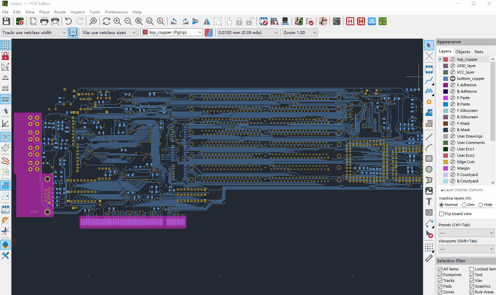

# HQ DFM

### Implementing One-Click PCB Design Flaw Analysis with HQ DFM in KiCad

The HQ DFM plugin will assist you in:

- One-click analysis of over 20 design risk issues including open circuits, disconnected traces, line spacing, and width.
- Automatically analyzing PCB design flaws and eliminating production difficulties and design defects.

After checking the design flaws, you can use the NextPCB plugin to directly add them to your shopping cart at Huaqiu.

## Features

### Design Parameter Analysis

HQ DFM will analyze the following parameters in your KiCad design:

- Layer Count
- Dimensions
- Signal Integrity
- Smallest Trace Width
- Smallest Trace Spacing
- Pad size
- Pad Spacing
- Hatched Copper Pour
- Hole Diameter
- RingHole
- Drill Hole Spacing
- Drill to Copper
- Board Edge Clearance
- Special Drill Holes
- Holes on SMD Pads
- Missing SMask Openings
- Drill Hole Density
- Surface Finish Area
- Test Point Count

## Installation

Install the latest release plugin from **Plugin and Content Manager**. Open the "Plugin and Content Manager" from the main window, Navigate to the "Plugins" section and locate "HQ DFM" in the list. Finally, Click on the "Install" button and "Apply Pending Changes" to finalize the installation process.

### About HQ DFM

HQ DFM is an efficient PCB design software that performs one-click analysis of design risks, provides optimization solutions, and generates Gerber, BOM, and coordinate files, making design and manufacturing simpler.

 you can use the HQDFM Gerber Viewer to double check your manufacturing files, adjust board parameters then add it to your NextPCB cart directly.

### About HQ PCB / NextPCB

HQ PCB specializes in reliable multilayer PCB manufacture and assembly, and like KiCad, our goal is to enable engineers to build tomorrow's electronics. NextPCB is working with KiCad to provide smart tools to simplify the progression from design to physical product. With 3 major factories catering to prototyping, mass production and PCB assembly, and over 15 years of engineering expertise, NextPCB believes our industrial experience will prove invaluable to KiCad users and the PCB design community.

We are a [KiCad Platinum Sponsor](https://www.nextpcb.com/blog/kicad-nextpcb-platinum-sponsorship).
